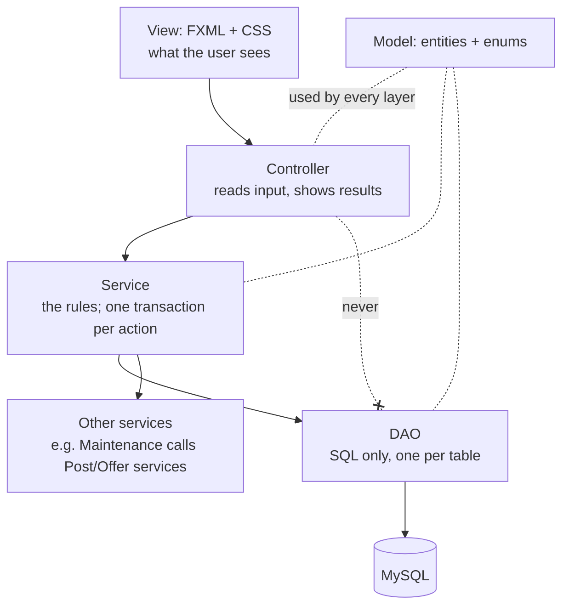
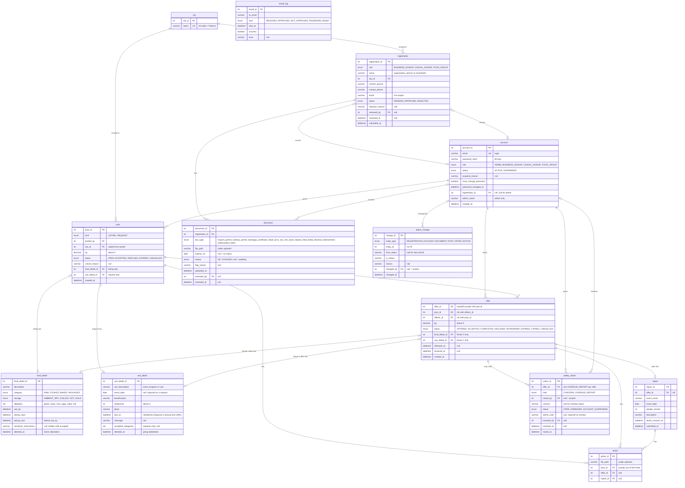

# ANIPLATO Architecture

The schema lives only in `sql/schema.sql` (thirteen tables). The diagram below mirrors Project Spec section 7.6.

---

```mermaid
flowchart TD
  V["View: FXML + CSS<br/>what the user sees"] --> C["Controller<br/>reads input, shows results"]
  C --> S["Service<br/>the rules; one transaction per action"]
  S --> D["DAO<br/>SQL only, one per table"]
  D --> DB[("MySQL")]
  M["Model: entities + enums"] -.used by every layer.- C
  M -.- S
  M -.- D
  S --> S2["Other services<br/>e.g. Maintenance calls Post/Offer services"]
  C -. never .-x D
```

```mermaid
erDiagram
  city ||--o{ registration : "located in"
  city ||--o{ post : "located in"
  registration ||--o{ document : "has"
  registration |o--o| account : "current"
  account ||--o{ post : "posts"
  account ||--o{ offer : "offers"
  post ||--o{ offer : "receives"
  post |o--o| food_detail : "listing has"
  post |o--o| use_detail : "request has"
  offer |o--o| food_detail : "Route 2 offer has"
  offer |o--o| use_detail : "Route 1 offer has"
  post ||--o{ photo : "has"
  offer ||--o{ photo : "has"
  report ||--o{ photo : "has"
  offer ||--o| report : "gets one"
  offer ||--o{ safety_notice : "may raise"
  account ||--o{ safety_notice : "raises"
  account |o--o{ safety_notice : "resolves"
  account |o--o{ registration : "reviews"
  account |o--o{ document : "reviews"
  account |o--o{ status_change : "changed by"

  city {
    int city_id PK
    varchar name UK "16 cities + Pateros"
  }

  registration {
    int registration_id PK
    enum role "BUSINESS_DONOR, CASUAL_DONOR, FOOD_GROUP"
    varchar name "organization, person or household"
    int city_id FK
    varchar contact_person
    varchar contact_phone
    varchar email "not unique"
    enum status "PENDING, APPROVED, REJECTED"
    varchar rejection_reason "null"
    int reviewed_by FK "null"
    datetime reviewed_at "null"
    datetime submitted_at
  }

  account {
    int account_id PK
    varchar email UK "login"
    varchar password_hash "BCrypt"
    enum role "ADMIN, BUSINESS_DONOR, CASUAL_DONOR, FOOD_GROUP"
    enum status "ACTIVE, SUSPENDED"
    varchar suspend_reason "null"
    boolean must_change_password
    datetime password_changed_at
    int registration_id FK "UK, null for admin"
    varchar admin_name "admin only"
    datetime created_at
  }

  document {
    int document_id PK
    int registration_id FK
    enum doc_type "mayors_permit, sanitary_permit, barangay_certificate, dswd, pcnc, sec_non_stock, deped_ched_tesda, diocese_endorsement, authorization_letter"
    varchar file_path "under uploads/"
    date expires_on "null = no expiry"
    enum review "OK, FLAGGED; null = awaiting"
    varchar flag_reason "null"
    datetime uploaded_at
    int reviewed_by FK "null"
    datetime reviewed_at "null"
  }

  post {
    int post_id PK
    enum kind "LISTING, REQUEST"
    int posted_by FK
    int city_id FK "copied from poster"
    decimal kg "above 0"
    enum status "OPEN, ACCEPTED, RESCUED, EXPIRED, CANCELLED"
    varchar cancel_reason "null"
    int food_detail_id FK "listing only"
    int use_detail_id FK "request only"
    datetime created_at
  }

  offer {
    int offer_id PK "handoff number HR-year-id"
    int post_id FK "UK with offerer_id"
    int offerer_id FK "UK with post_id"
    decimal kg "above 0"
    enum status "OFFERED, ACCEPTED, COMPLETED, DECLINED, WITHDRAWN, EXPIRED, LAPSED, CANCELLED"
    int food_detail_id FK "Route 2 only"
    int use_detail_id FK "Route 1 only"
    datetime released_at "null"
    datetime received_at "null"
    datetime created_at
  }

  food_detail {
    int food_detail_id PK
    varchar description
    enum category "RAW, COOKED, BAKED, PACKAGED"
    enum storage "AMBIENT_DRY, CHILLED, HOT_HOLD"
    set allergens "gluten, dairy, nuts, eggs, halal; null"
    datetime use_by
    datetime pickup_start
    datetime pickup_end "before use_by"
    varchar handover_instructions "null, hidden until accepted"
    datetime attested_at "donor attestation"
  }

  use_detail {
    int use_detail_id PK
    varchar use_description "event, program or use"
    date event_date "null, required on a request"
    varchar beneficiaries
    int headcount "above 0"
    varchar place
    datetime due_at "needed-by (request) or pickup time (offer)"
    varchar message "null"
    set accepted_categories "requests only; null"
    datetime attested_at "group attestation"
  }

  photo {
    int photo_id PK
    varchar file_path "under uploads/"
    int post_id FK "exactly one of the three"
    int offer_id FK "null"
    int report_id FK "null"
  }

  report {
    int report_id PK
    int offer_id FK "UK"
    varchar event_name
    date event_date
    int people_served
    varchar description
    datetime photo_consent_at
    datetime submitted_at
  }

  safety_notice {
    int notice_id PK
    int offer_id FK "one OVERDUE_REPORT per offer"
    enum kind "CONCERN, OVERDUE_REPORT"
    int raised_by FK "null = system"
    varchar concern "null for overdue report"
    enum status "OPEN, DISMISSED, ACCOUNT_SUSPENDED"
    varchar admin_note "null, required on resolve"
    int resolved_by FK "null"
    datetime resolved_at "null"
    datetime raised_at
  }

  status_change {
    int change_id PK
    enum entity_type "REGISTRATION, ACCOUNT, DOCUMENT, POST, OFFER, NOTICE"
    int entity_id "no FK"
    varchar from_status "null for new record"
    varchar to_status
    varchar reason "null"
    int changed_by FK "null = system"
    datetime changed_at
  }

  email_log {
    int email_id PK
    varchar to_email
    enum kind "RECEIVED, APPROVED, NOT_APPROVED, PASSWORD_RESET"
    datetime sent_at
    boolean success
    varchar error "null"
  }
```
